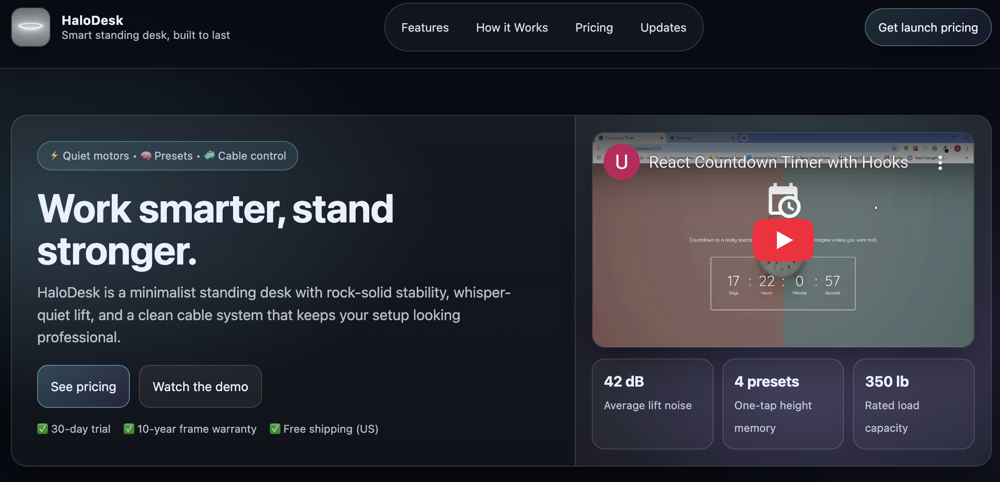

# Product Landing Page (HaloDesk)

A responsive product landing page built with HTML, CSS, and a small amount of JavaScript.  
Created as a freeCodeCamp certification project.

## Features
- Sticky navigation bar with smooth scrolling
- Responsive layout (mobile-friendly)
- Embedded product video section
- Email signup form

## Screenshot


## Technologies Used
- HTML5
- CSS3 (Flexbox + Grid)
- JavaScript (minor UI utility)

## How to Run
Open `index.html` in your browser  
(or use VS Code Live Server)

## Certification
This project fulfills the **Product Landing Page** requirement for the **freeCodeCamp Responsive Web Design Certification**.

## freeCodeCamp Testing Note

This repository represents the **portfolio version** of the project.

- The logo image (`white_halo.png`) is stored locally so it displays correctly on GitHub and GitHub Pages.
- freeCodeCamp tests require the `#header-img` `src` attribute to be a **valid hosted URL**.

If you need to re-run the freeCodeCamp tests, temporarily replace the image source with a hosted image, for example:

```html


